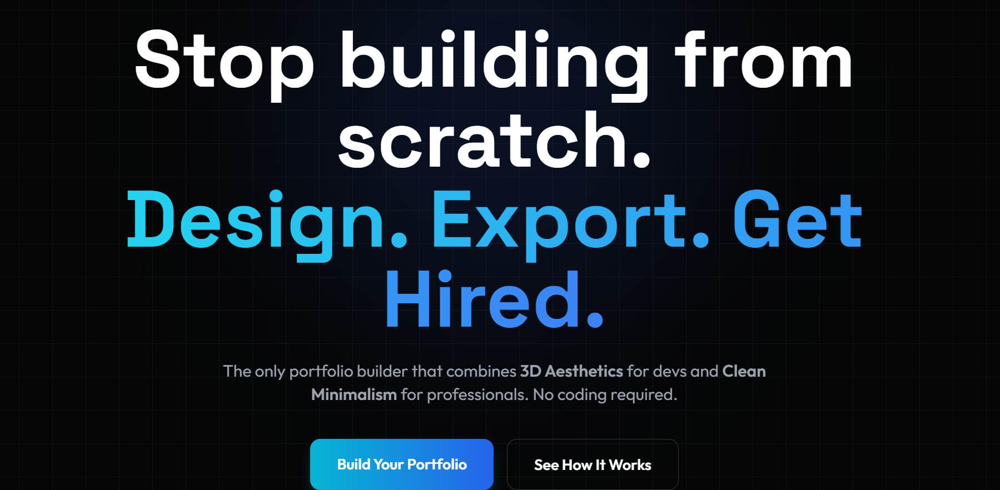
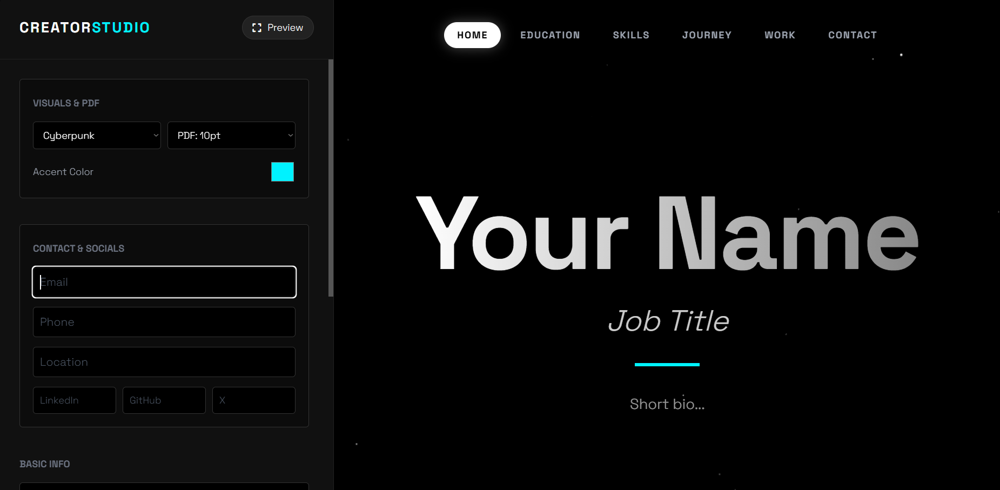
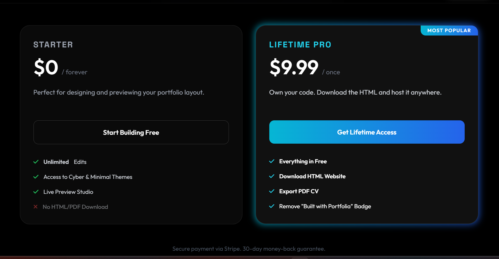
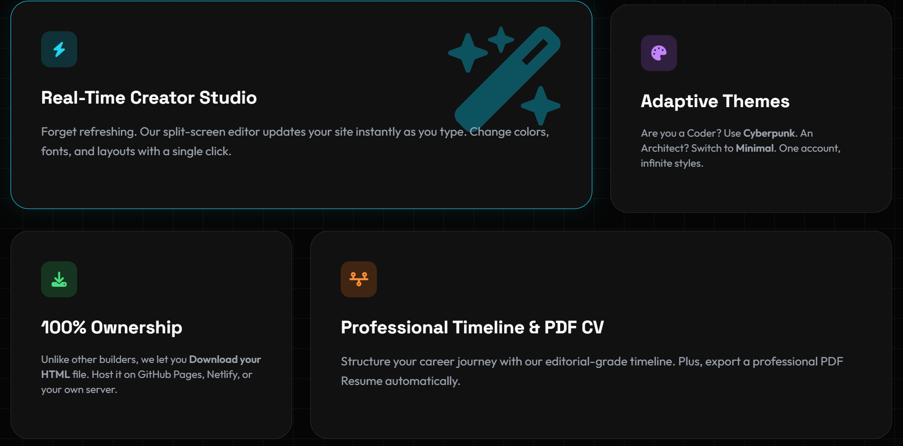

# 🚀 Portfolia.dev - The Ultimate SaaS Portfolio Builder

> **Stop building from scratch. Design. Export. Get Hired.**
>
> A secure, full-stack SaaS platform that allows professionals to generate high-end 3D & Minimal Portfolios and Harvard-style PDF Resumes in minutes.

---

## 🌟 Project Overview

**Portfolia** is a production-ready **SaaS ecosystem** developed to solve the problem of creating professional personal websites and resumes effortlessly.

This repository serves as a showcase for the application's capabilities. **The source code is currently private** as this is a commercial product.

> **Interested in the code?**
> If you are a recruiter or prospective client wanting to review the code architecture, please contact me directly.

---

## ✨ Key Features Implemented

### 🎨 The Creator Studio (Real-Time Editor)
* **Architecture:** Built with Python/Flask and Vanilla JS for zero-latency updates.
* **Functionality:** Users input data on the left, and the DOM updates instantly via event listeners, without server roundtrips.
* **Themes:** Dynamic CSS variable injection allows switching between **Cyberpunk** and **Minimal** modes.

### 📄 PDF Generation Engine
* **Technology:** Uses `WeasyPrint` backend rendering.
* **Logic:** Converts Jinja2 HTML templates into strict A4 PDF layouts on the fly.
* **Features:** Handles page breaks, dynamic font sizing (8pt-14pt), and print-ready CSS.

### 💳 Payments & Security Stack
* **Stripe Integration:** Full checkout session handling with Webhooks.
* **Security Measures:**
    * `Flask-Bcrypt` for password hashing.
    * `Flask-Limiter` for API rate limiting.
    * `Flask-Talisman` for Content Security Policy (CSP).
* **Database:** Managed PostgreSQL instance on Cloud Infrastructure.

---

## 🛠️ Technical Stack

| Category | Technologies Used |
| :--- | :--- |
| **Backend** | Python 3.11, Flask, Gunicorn |
| **Database** | PostgreSQL, SQLAlchemy ORM |
| **Frontend** | HTML5, TailwindCSS, JavaScript (ES6) |
| **Services** | Stripe API (Payments), Resend (SMTP Emails) |
| **DevOps** | Docker-ready, Render Cloud Hosting |

---

## 📸 Application Gallery

### Landing Page
High-conversion landing page with CSS Grid animations.

### Features Grid
Service breakdown and value proposition.

---

**Developed by [Vdamoulas](https://github.com/Vdamoulas).**

